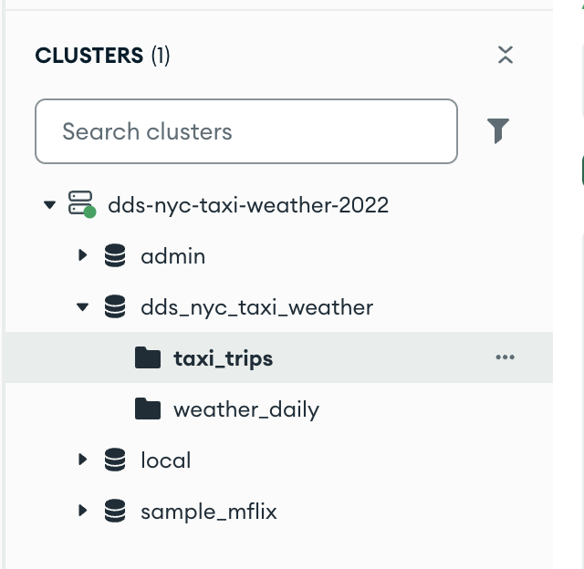

# dds-nyc-taxi-weather
Distributed Data Systems group project: NYC Yellow Taxi (2022) + NYC Weather data pipeline (MongoDB, Airflow, Spark SQL, BigQuery)

# Distributed Data Systems Project  
## NYC Yellow Taxi & Weather Data Pipeline (2022)

### Project Overview
This project analyzes the relationship between NYC Yellow Taxi trips and weather conditions for the year **2022**.

We are building a distributed data pipeline using:

- MongoDB (Data Storage)
- Airflow (Orchestration)
- Spark SQL (Distributed Processing)
- BigQuery (Cloud Analytics)

---

## Datasets Used

### 1️⃣ NYC Yellow Taxi Trip Data (2022)
Official NYC Open Data source:

https://data.cityofnewyork.us/Transportation/2022-Yellow-Taxi-Trip-Data/qp3b-zxtp/about_data

- Contains detailed trip-level records
- Includes pickup/dropoff timestamps, fare details, payment types, trip distance, etc.
- We will use only **2022 data**

---

### 2️⃣ NYC Weather Data
Kaggle dataset:

https://www.kaggle.com/datasets/danbraswell/new-york-city-weather-18692022

- Contains daily weather observations from 1869–2022
- For this project, we will filter and use **only 2022 weather data**

---

## Project Goal

To build a distributed data system that:

- Ingests taxi and weather datasets
- Stores data in MongoDB
- Uses Spark SQL for distributed analytics
- Orchestrates pipelines using Airflow
- Performs cloud analytics using BigQuery

---

## 📁 Project Structure

```bash
dds-nyc-taxi-weather/
│
├── config/                     # Configuration files (Mongo URI, settings)
│
├── data/
│   ├── raw/                    # Raw downloaded datasets (parquet, csv)
│   └── processed/              # Cleaned/processed datasets (future use)
│
├── notebooks/                  # Exploratory analysis & Spark SQL notebooks
│
├── scripts/
│   ├── load_taxi_data.py       # Loads taxi parquet into MongoDB Atlas
│   ├── load_weather_data.py    # Loads filtered weather data (2022 only)
│   └── test_connection.py      # (local only, not committed)
│
├── README.md
├── LICENSE
└── requirements.txt            # Python
```


## MongoDB Atlas Setup + Local Ingestion (Feb 16)

### 1) MongoDB Atlas
- Created Atlas cluster: `dds-nyc-taxi-weather-2022`
- Database created: `dds_nyc_taxi_weather`
- Collections:
  - `taxi_trips` (target for yellow taxi data)
  - `test_collection` (used to validate connectivity)

Security notes:
- IP Access List: added local IP (Atlas UI “Network Access”)
- Create your own MongoDB Atlas cluster and set:
  export MONGO_URI="mongodb+srv://<user>:<pass>@<cluster>/"
- Database user created in Atlas (credentials stored locally via environment variables).

### 2) Local repo + environment
```bash
git clone <repo-url>
cd dds-nyc-taxi-weather
python3 -m venv venv_dds_mongodb_2022
source venv_dds_mongodb_2022/bin/activate
pip install pymongo pandas pyarrow tqdm

mkdir -p data/raw
cd data/raw
curl -O https://d37ci6vzurychx.cloudfront.net/trip-data/yellow_tripdata_2022-01.parquet
cd ../..
```

## MongoDB Atlas Setup

- Successfully connected to MongoDB Atlas cluster
- Loaded:
  - NYC Taxi trips data
  - NYC Central Park weather data (filtered for 2022 only)
- Weather collection: `weather_daily` (363 records)
- Taxi collection: `taxi_trips`

Data ingestion handled via:
- `scripts/load_taxi_data.py`
- `scripts/load_weather_data.py`
  
### Atlas Screenshot




## Daily Taxi Summary Aggregation

We created a MongoDB aggregation pipeline to summarize 2022 NYC taxi trips at the daily level.

This pipeline:
- filters taxi trips to 2022 only
- derives `trip_date` from `tpep_pickup_datetime`
- computes trip duration in minutes
- aggregates daily metrics:
  - `total_trips`
  - `avg_trip_distance`
  - `avg_fare_amount`
  - `avg_total_amount`
  - `avg_passenger_count`
  - `avg_trip_duration_minutes`
- writes the result to a new collection: `daily_taxi_summary`

This collection will be used in the next step to join with `weather_daily` and create the integrated analytics dataset.
